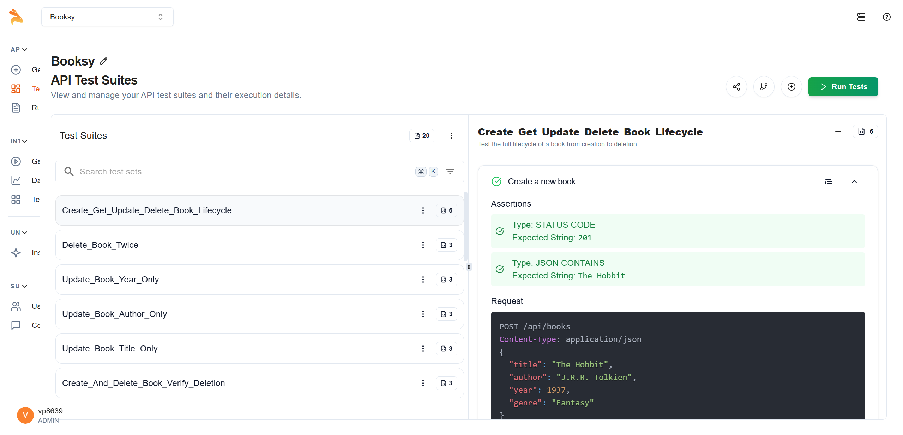
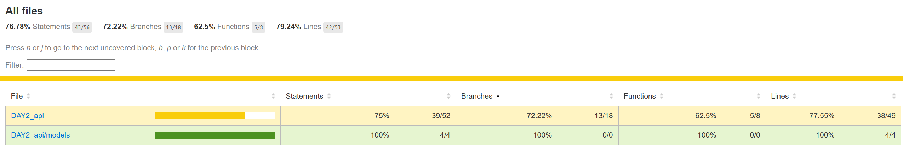

# Bookstore API Server and Frontend

This project consists of a Node.js API server built with Express and MongoDB for managing a bookstore's inventory and a React frontend for a user-friendly interface to interact with the API. The API is publicly accessible through ngrok tunneling.

## Project Overview

- **Backend**: Node.js with Express, connected to MongoDB for CRUD operations on book data.
- **Frontend**: React single-page application styled with Tailwind CSS, using Axios for API requests.
- **Features**: View, add, edit, and delete books via both API and frontend interface.
- **Testing**: Comprehensive test suite with unit, integration, and API tests using Jest and Supertest.
- **Deployment**: API exposed publicly via ngrok for remote access.



## API Access

The API is accessible in two ways:

- **Local Access**: `http://localhost:3000/api`
- **Public Access via ngrok**: `https://b353-2409-40f4-411e-bbb2-202f-483e-ef4a-b158.ngrok-free.app`

### API Documentation

API documentation is available through Swagger UI at:

- **Local**: `http://localhost:3000/api-docs`
- **Public**: `https://b353-2409-40f4-411e-bbb2-202f-483e-ef4a-b158.ngrok-free.app/api-docs`

## API Endpoints

### `GET /api/books`

- **Description**: Retrieves all books.
- **Response**: Array of book objects.
- **Sample Response**:
  ```json
  [
    { "_id": "123", "title": "Book Title", "author": "Author Name", "year": 2020, "genre": "Fiction" },
    ...
  ]
  ```

### `GET /api/books/:id`

- **Description**: Retrieves a single book by ID.
- **Response**: Book object or 404 if not found.
- **Sample Response**:
  ```json
  {
    "_id": "123",
    "title": "Book Title",
    "author": "Author Name",
    "year": 2020,
    "genre": "Fiction"
  }
  ```

### `POST /api/books`

- **Description**: Creates a new book.
- **Request Body**:
  ```json
  { "title": "string", "author": "string", "year": number, "genre": "string" }
  ```
- **Response**: Created book object.
- **Sample Response**:
  ```json
  {
    "_id": "123",
    "title": "Book Title",
    "author": "Author Name",
    "year": 2020,
    "genre": "Fiction"
  }
  ```

### `PUT /api/books/:id`

- **Description**: Updates a book by ID.
- **Request Body**:
  ```json
  { "title": "string", "author": "string", "year": number, "genre": "string" }
  ```
- **Response**: Updated book object or 404 if not found.
- **Sample Response**:
  ```json
  {
    "_id": "123",
    "title": "Updated Title",
    "author": "Author Name",
    "year": 2021,
    "genre": "Fiction"
  }
  ```

### `DELETE /api/books/:id`

- **Description**: Deletes a book by ID.
- **Response**: Success message or 404 if not found.
- **Sample Response**:
  ```json
  { "message": "Book deleted successfully" }
  ```

## Tech Stack

- **Backend**:
  - Node.js
  - Express.js
  - MongoDB
  - Mongoose (ODM)
  - Swagger UI for API documentation
- **Frontend**:
  - React
  - Tailwind CSS
  - Axios
- **Testing**:
  - Jest (Testing framework)
  - Supertest (API testing)
  - MongoDB Memory Server (In-memory database for integration tests)
  - Istanbul/NYC (Test coverage)
- **Deployment**:
  - ngrok for public API exposure

## Setup Instructions

### Prerequisites

- Node.js (v14 or higher)
- MongoDB (running locally on default port 27017 or provide a MongoDB URI)
- Git
- ngrok (for public exposure - optional)

### Installation

1. Clone the repository:
   ```bash
   git clone https://github.com/vikranth2711/Keploy_API_Fellowship.git
   cd bookstore-api
   ```
2. Install dependencies:
   ```bash
   npm install
   ```

### Run the Backend Locally

1. Start MongoDB (ensure it's running).
2. Run:
   ```bash
   npm start
   ```
   The server will be available at `http://localhost:3000`.

### Expose API Publicly with ngrok

1. Install ngrok if not already installed:
   ```bash
   npm install -g ngrok
   ```
2. Expose your local server:
   ```bash
   ngrok http 3000
   ```
3. Copy the ngrok HTTPS URL (it looks like `https://xxxx-xxxx-xxxx.ngrok-free.app`) and use it to access your API publicly.

### Access the Frontend

1. Open `index.html` in a web browser
2. If needed, update the `API_BASE_URL` in the script section to point to your ngrok URL or local server.

### Running Tests

1. Run all tests:
   ```bash
   npm test
   ```
2. Generate test coverage:
   ```bash
   npm run test:coverage
   ```
   Coverage reports are saved in the `coverage/` directory.

## Test Coverage Results

The project has comprehensive test coverage for all components. Below is a screenshot of the test coverage report generated by Istanbul/NYC:



## Testing APIs

### Local Testing

- Get all books:
  ```bash
  curl http://localhost:3000/api/books
  ```
- Create a book:
  ```bash
  curl -X POST http://localhost:3000/api/books -H "Content-Type: application/json" -d '{"title":"The Great Gatsby","author":"F. Scott Fitzgerald","year":1925,"genre":"Fiction"}'
  ```

### Remote Testing (via ngrok)

- Get all books:
  ```bash
  curl https://b353-2409-40f4-411e-bbb2-202f-483e-ef4a-b158.ngrok-free.app/books
  ```
- Create a book:
  ```bash
  curl -X POST https://b353-2409-40f4-411e-bbb2-202f-483e-ef4a-b158.ngrok-free.app/books -H "Content-Type: application/json" -d '{"title":"The Great Gatsby","author":"F. Scott Fitzgerald","year":1925,"genre":"Fiction"}'
  ```

## Notes

- The ngrok URL changes each time you restart ngrok unless you have a paid account with a fixed subdomain.
- Remember to update the `API_BASE_URL` in `index.html` when your ngrok URL changes.
- For production, consider a permanent hosting solution instead of ngrok.
- CORS is configured to accept requests from any origin (`*`) which is acceptable for development but should be restricted in production.

## GitHub Repository

The complete codebase, including tests, is available at:
[https://github.com/vikranth2711/Keploy_API_Fellowship](https://github.com/vikranth2711/Keploy_API_Fellowship)
